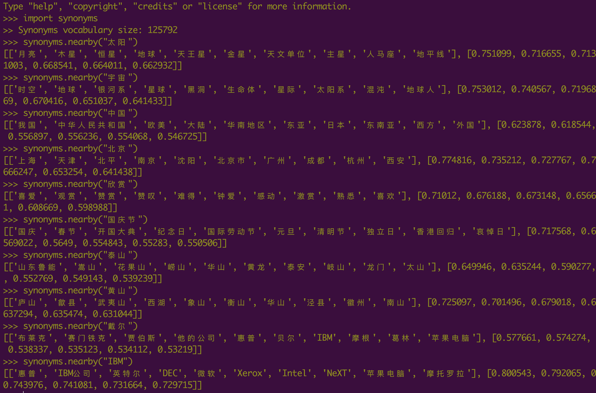
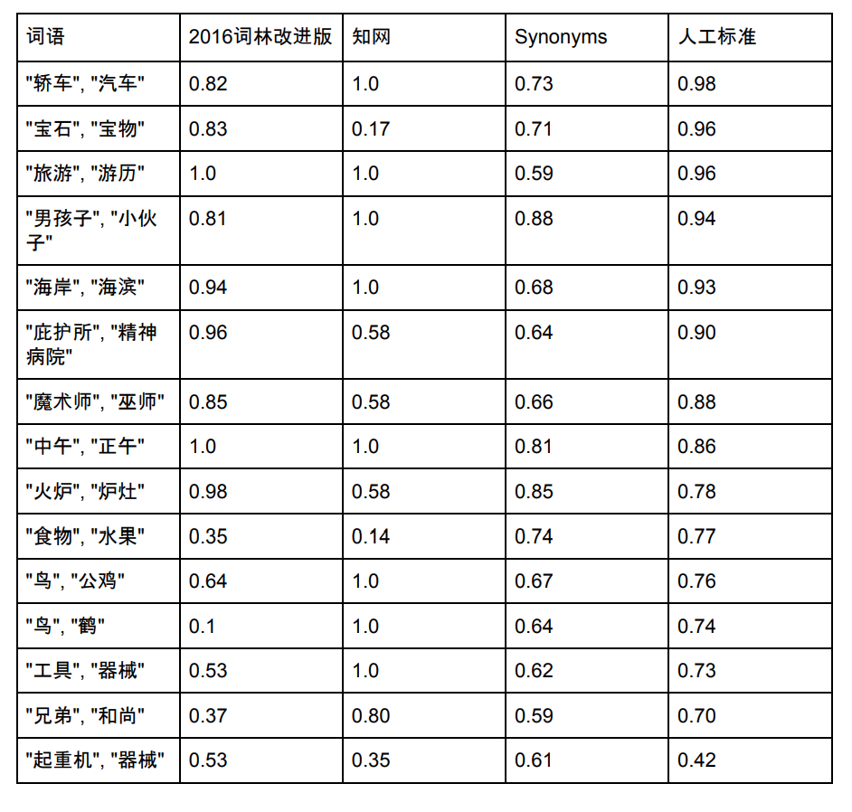

# Synonyms
Chinese Synonyms for Natural Language Processing and Understanding.

最好的中文近义词工具包。

```synonyms```可以用于自然语言理解的很多任务：文本对齐，推荐算法，相似度计算，语义偏移，关键字提取，概念提取，自动摘要，搜索引擎等。


# Welcome

```
pip install -U synonyms
```
兼容py2和py3，当前稳定版本 v2.1。


## Samples



## Usage

### synonyms#nearby
```
import synonyms
print("人脸: %s" % (synonyms.nearby("人脸")))
print("识别: %s" % (synonyms.nearby("识别")))
print("NOT_EXIST: %s" % (synonyms.nearby("NOT_EXIST")))
```

```synonyms.nearby(WORD)```返回一个list，list中包含两项：```[[nearby_words], [nearby_words_score]]```，```nearby_words```是WORD的近义词们，也以list的方式存储，并且按照距离的长度由近及远排列，```nearby_words_score```是```nearby_words```中**对应位置**的词的距离的分数，分数在(0-1)区间内，越接近于1，代表越相近。比如:

```
synonyms.nearby(人脸) = [
    ["图片", "图像", "通过观察", "数字图像", "几何图形", "脸部", "图象", "放大镜", "面孔", "Mii"], 
    [0.597284, 0.580373, 0.568486, 0.535674, 0.531835, 0.530
095, 0.525344, 0.524009, 0.523101, 0.516046]]
```

在OOV的情况下，返回  ```[[], []]```，目前的字典大小: 125,792。

### synonyms#compare
两个句子的相似度比较

```
    sen1 = "发生历史性变革"
    sen2 = "发生历史性变革"
    r = synonyms.compare(sen1, sen2, seg=True)
```

其中，参数 seg 表示 synonyms.compare是否对sen1 和 sen2进行分词，默认为 True。返回值：[0-1]，并且越接近于1代表两个句子越相似。

```
旗帜引领方向 vs 道路决定命运: 0.429
旗帜引领方向 vs 旗帜指引道路: 0.93
发生历史性变革 vs 发生历史性变革: 1.0
```

* 句子相似度准确率

在[SentenceSim](https://github.com/fssqawj/SentenceSim/blob/master/dev.txt)上进行测试。

```
测试语料条数为：7516条.
设定阈值 0.5：
  相似度 > 0.5, 返回相似；
  相似度 < 0.5, 返回不相似.
```

评测结果：

```
正确 : 6626，错误 : 890，准确度 : 88.15%
```

关于距离计算和阀值选取，参考 [enhance Synonyms#compare](https://github.com/huyingxi/Synonyms/issues/6)。

### synonyms#display
以友好的方式打印近义词，方便调试，```display```调用了 ```synonyms#nearby``` 方法。

```
>>> synonyms.display("飞机")
'飞机'近义词：
  1. 架飞机:0.837399
  2. 客机:0.764609
  3. 直升机:0.762116
  4. 民航机:0.750519
  5. 航机:0.750116
  6. 起飞:0.735736
  7. 战机:0.734975
  8. 飞行中:0.732649
  9. 航空器:0.723945
  10. 运输机:0.720578
```

## PCA


## Demo
```
$ pip install -r Requirements.txt
$ python demo.py
```

## Voice of Users


## Data
```
synonyms/data/words.nearby.x.pklz # compressed pickle object
```

data is built based on [wikidata-corpus](https://github.com/Samurais/wikidata-corpus).

## Valuation

### 同义词词林
《同义词词林》是梅家驹等人于1983年编纂而成，现在使用广泛的是哈工大社会计算与信息检索研究中心维护的《同义词词林扩展版》，它精细的将中文词汇划分成大类和小类，梳理了词汇间的关系，同义词词林扩展版包含词语77,343条，其中32,470被以开放数据形式共享。

### 知网, HowNet
HowNet，也被称为知网，它并不只是一个语义字典，而是一个知识系统，词汇之间的关系是其一个基本使用场景。知网包含词语8,265条。

国际上对词语相似度算法的评价标准普遍采用 Miller&Charles 发布的英语词对集的人工判定值。该词对集由十对高度相关、十对中度相关、十对低度相关共 30 个英语词对组成,然后让38个受试者对这30对进行语义相关度判断，最后取他们的平均值作为人工判定标准。然后不同近义词工具也对这些词汇进行相似度评分，与人工判定标准做比较，比如使用皮尔森相关系数。在中文领域，使用这个词表的翻译版进行中文近义词比较也是常用的办法。

### 对比
Synonyms的词表容量是125,792，下面选择一些在同义词词林、知网和Synonyms都存在的几个词，给出其近似度的对比：



注：同义词林及知网数据、分数来源, https://github.com/yaleimeng/Final_word_Similarity

## Benchmark

Test with py3, MacBook Pro.

```
python benchmark.py
```

++++++++++ OS Name and version ++++++++++

Platform: Darwin

Kernel: 16.7.0

Architecture: ('64bit', '')

++++++++++ CPU Cores ++++++++++

Cores: 4

CPU Load: 60

++++++++++ System Memory ++++++++++

meminfo 8GB

```synonyms#nearby: 100000 loops, best of 3 epochs: 0.209 usec per loop```


## Live Sharing

[52nlp.cn](http://www.52nlp.cn/synonyms-%E4%B8%AD%E6%96%87%E8%BF%91%E4%B9%89%E8%AF%8D%E5%B7%A5%E5%85%B7%E5%8C%85)

[机器之心](https://www.jiqizhixin.com/articles/2018-01-14-3)

[线上分享: Synonyms 中文近义词工具包 @ 2018-02-07](https://github.com/huyingxi/Synonyms/issues/21)

## Statement

[Synonyms](https://github.com/huyingxi/Synonyms)发布证书 GPL 3.0。数据和程序可用于研究和商业产品，必须注明引用和地址，比如发布的任何媒体、期刊、杂志或博客等内容。
```
@online{Synonyms:hain2017,
  author = {Hai Liang Wang, Hu Ying Xi},
  title = {中文近义词工具包Synonyms},
  year = 2017,
  url = {https://github.com/huyingxi/Synonyms},
  urldate = {2017-09-27}
}
```

任何基于[Synonyms](https://github.com/huyingxi/Synonyms)衍生的数据和项目也需要开放并需要声明一致的“声明”。

# References

[wikidata-corpus](https://github.com/Samurais/wikidata-corpus)

[word2vec原理推导与代码分析](http://www.hankcs.com/nlp/word2vec.html)

# Authors

[Hai Liang Wang](http://blog.chatbot.io/webcv/)

[Hu Ying Xi](https://github.com/huyingxi/)

# Give credits to

[Word2vec by Google](https://code.google.com/archive/p/word2vec/)

[Wikimedia: 训练语料来源](https://dumps.wikimedia.org/)

[gensim: word2vec.py](https://github.com/RaRe-Technologies/gensim)

[SentenceSim: 相似度评测语料](https://github.com/fssqawj/SentenceSim/)

[jieba: 中文分词](https://github.com/fxsjy/jieba)

# License
[GPL3.0](./LICENSE)